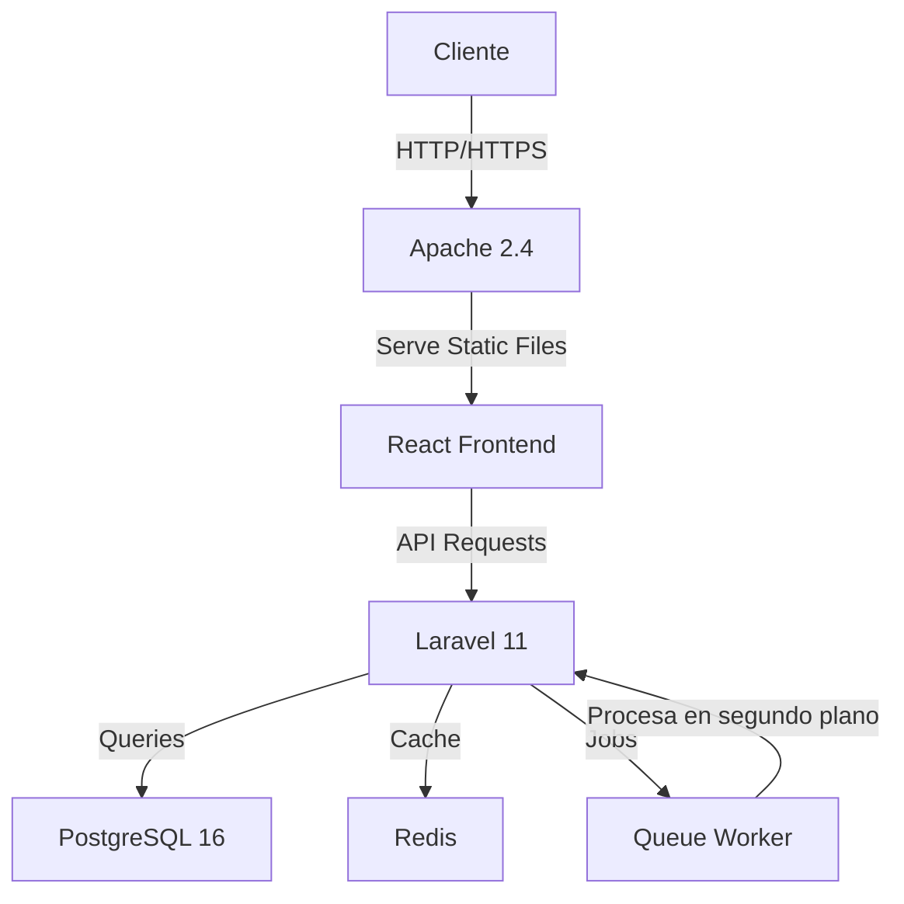

# Sistema de Control y Monitoreo INE DEPPP DPT 🏢

[](https://laravel.com)
[](https://php.net)
[](https://postgresql.org)
[](https://reactjs.org)
[](https://tailwindcss.com)
[](https://microsoft.com)

[Ver Demo](/) | [Reportar Bug](/) | [Solicitar Feature](/)

## 🌟 Vista General del Proyecto

Sistema empresarial de última generación desarrollado para el **Instituto Nacional Electoral (INE)** - Dirección Ejecutiva de Prerrogativas y Partidos Políticos (DEPPP). Este proyecto representa una solución integral que combina tecnologías modernas con necesidades institucionales críticas.

### 🎯 Objetivos del Proyecto

- Automatización del control de asistencia
- Monitoreo en tiempo real de infraestructura
- Optimización de procesos internos
- Análisis de datos y reportes avanzados

### 🖥️ Capturas de Pantalla


*Dashboard principal con métricas en tiempo real*

## ⚡ Stack Tecnológico

### Backend
- **PHP 8.2** - Motor principal
- **Laravel 12** - Framework de desarrollo
- **PostgreSQL 16** - Base de datos principal
- **Apache 2.4** - Servidor web
- **Windows Server 2019** - Sistema operativo

### Frontend
- **React** - Biblioteca UI
- **Tailwind CSS** - Framework de estilos
- **JavaScript ES6+** - Lógica del cliente
- **Axios** - Cliente HTTP
- **Chart.js** - Visualización de datos

### DevOps & Herramientas
- **Git** - Control de versiones
- **Jenkins** - CI/CD
- **Redis** - Caché y colas
- **Supervisor** - Gestión de procesos

## 🚀 Características Destacadas

### Control de Asistencia
- Sistema biométrico integrado
- Registro en tiempo real
- Reportes personalizados
- Actualizacion Asincrona


### Monitoreo de Servidores
- Dashboard en tiempo real
- Alertas proactivas
- Métricas de rendimiento
- Logs centralizados

### Interfaz Moderna
- Diseño responsive
- Tema oscuro/claro
- Componentes reutilizables
- Animaciones fluidas

## 📋 Requisitos del Sistema

```bash
# Versiones específicas requeridas
PHP >= 8.2
PostgreSQL >= 16.0
Node.js >= 18.0
npm >= 9.0
Apache >= 2.4
Windows Server 2019
```

## 🛠️ Guía de Instalación

1. **Clonar el repositorio**
```Powershell
git clone https://github.com/revotk/DPT.git
cd DPT
```

2. **Configurar el entorno**
```Powershell
# Instalar dependencias de PHP
composer install

# Instalar dependencias de Node.js
npm install

# Configurar variables de entorno
cp .env.example .env
php artisan key:generate
```

3. **Configurar la base de datos**
```Powershell
# Crear la base de datos en PostgreSQL
createdb nombre_db

# Ejecutar migraciones
php artisan migrate --seed
```

4. **Compilar assets**
```Powershell
npm run dev # para desarrollo
npm run build # para producción
```

## 🔄 Arquitectura del Sistema



## 📈 Roadmap

- [x] Control de asistencia básico
- [x] Monitoreo de servidores
- [x] Integración con Active Directory
- [ ] Módulo de reportes avanzados
- [ ] API pública
- [ ] Aplicación móvil

## 👨‍💻 Autor

**Ismael Grijalva Solorzano**
- LinkedIn: [Ismael Grijalva](https://www.linkedin.com/in/igriso/)
- GitHub: [Perfil de GitHub](https://github.com/revotk)
- Email: [ismael.grijalva@ine.mx](mailto:ismael.grijalva@ine.mx)

## 📄 Licencia

Este proyecto es propiedad del Instituto Nacional Electoral (INE) - México.
Desarrollado por Ismael Grijalva Solorzano © 2025. Todos los derechos reservados.

---

### 🌟 ¿Te gustaría contribuir?

Toda contribución es bienvenida. ¡Revisa nuestras [guías de contribución](/)!

---

*Desarrollado con ❤️ en México | INE DEPPP DPT 2025*
